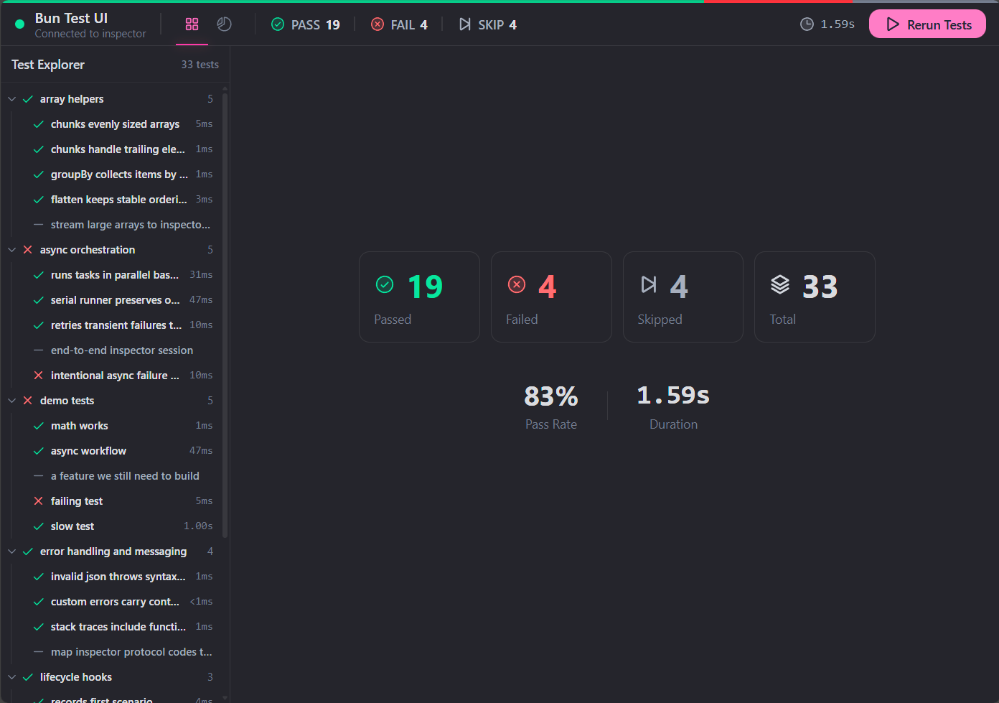

# bun-test-ui

A visual test runner UI for Bun, similar to [Vitest UI](https://vitest.dev/guide/ui.html).




## Install

```bash
bun add -d bun-test-ui
```

## Usage

```bash
bunx bun-test-ui
```

This starts the UI at `http://localhost:51205` and auto-opens your system browser.

### Options

```bash
bunx bun-test-ui [pattern] [options]

Options:
  -p, --port <number>  Port to run on (default: 51205)
  --no-watch           Disable watch mode
  --no-open            Don't auto-open browser
```

## Config

The CLI reads your `bunfig.toml` for test configuration:

```toml
[test]
root = "./tests"
```

Watch mode watches the current directory:

- **Test file changes** → Only that test file is re-run
- **Source file changes** → All tests are re-run

## How it works

Uses [bun-inspector-protocol](https://github.com/oven-sh/bun/blob/main/packages/bun-inspector-protocol/README.md) to communicate with Bun's test runner via the WebSocket inspector, similar to how `bun-vscode` implements VS Code test runner support.

## Development

```bash
bun install

# Dev server with HMR
bun run dev

# Build for prod
bun run build

# Run prod CLI
bun run start
```

## License

MIT
